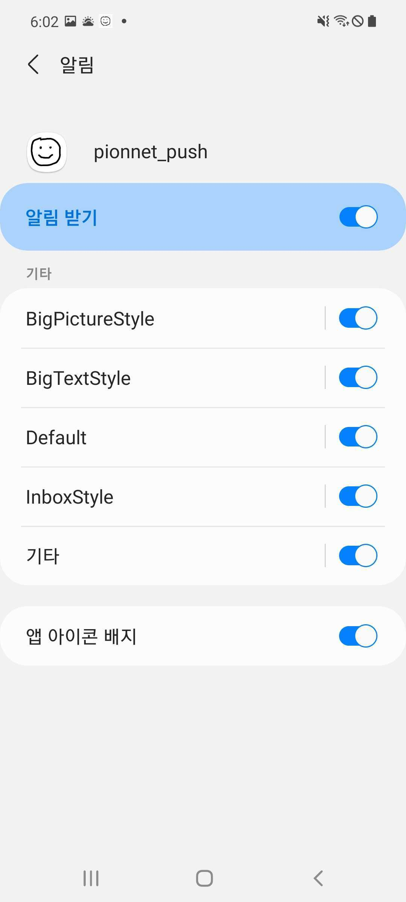

## Preview
- Client App for FCM(Firebase Cloud Messaging)
- Custom Notification Channels
- Demo App for Google MLKit Barcode Scanning feature
- Scan Barcode with the camera or import images of barcode from the gallery

## App Structure
- MainActivity
	- `NotificationManagerCompat` checking notification setting
	- sends fcm token data to the server
- MyFirebaseMessagingService
	- creates notification channel after receiving a message
	- launches MainActivity
- MyAPI
	- an interface for token sending API
- BarcodeCameraActivity
	- `ImageAnalysis` returns ImageProxy, a wrapper object for Image data
	- `BarcodeScanner` processing InputImage data

	

## Trial and Error
- deprecated init function
	- `FirebaseInstanceId` -> `FirebaseMessaging.getInstance()`
	
- build error occurred after building apk file
	- delete .apk file, or run `rm -r .gradle`
	
- `onMessageReceived()` not called when sending message via Firebase console
	- message with `message.notification` data is classified as a notification message
	- notification message calls `onMessageReceived()` *only when app is in foreground*

- setting custom notification style
	- `NotificationCompat.Builder::setStyle()`
<p align="center">
	
</p>

- unable to scan barcode image with higher resolution
	- resize bitmap file to optimal resolution
	```kotlin
    var bitmap = byteArray.toBitmap()
    if (bitmap.width > 1080) {
		val newHeight = bitmap.height * 1080 / bitmap.width
		bitmap = Bitmap.createScaledBitmap(bitmap, 1080, newHeight, false)
	}
	```

- imageAnalysis not working while camera preview is running
	- bind ProcessCameraProvider with imageAnalysis object
	```kotlin
	val camera = cameraProvider.bindToLifecycle(this, cameraSelector, preview, imageAnalysis)
	```

## References
- [안드로이드 앱 FCM 푸시 알림 예제](https://blog.naver.com/PostView.naver?blogId=ndb796&logNo=221553341369&redirect=Dlog&widgetTypeCall=true&directAccess=false)
- [Firebase 메시지 전송](https://team-platform.tistory.com/23)
- [다수의 Notification channel 관리시 주의사항](https://dev3m.tistory.com/entry/%EB%8B%A4%EC%88%98%EC%9D%98-Notification-channel-%EA%B4%80%EB%A6%AC%EC%8B%9C-%EC%A3%BC%EC%9D%98%EC%82%AC%ED%95%AD)
- [Using Google's MLKit and CameraX for Lightweight Barcode Scanning ](https://beakutis.medium.com/using-googles-mlkit-and-camerax-for-lightweight-barcode-scanning-bb2038164cdc)